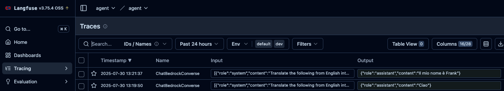

# Tracing and Evaluating Agents on EKS

This guide continues from [Building and Deploying Agents](./building-agents.md), where we containerized and deployed an agent into our Kubernetes environment. Now we'll add observability with LangFuse tracing and set up evaluations to ensure our agent continues to perform well as we make changes.

## Tracing The Agent

The Agents on EKS environment comes with LangFuse already deployed and available to our agents. The [Strands Agents SDK](https://strandsagents.com) supports observability via [OpenTelemetry](https://strandsagents.com/latest/documentation/docs/user-guide/observability-evaluation/observability/), which integrates with LangFuse for tracing, evaluation, and monitoring.

To begin using LangFuse, connect to it using Kubernetes port-forwarding:

```bash
kubectl port-forward -n langfuse svc/langfuse-web 3000
```

You can then open a web browser at `http://localhost:3000`, register an account (this is all local to your cluster) and log in, create an organization and create a project. You will also need to [create an API key](https://langfuse.com/faq/all/where-are-langfuse-api-keys).

### Add Tracing to Agent

To add LangFuse tracing to the agent, add the `langfuse` package to `requirements.txt`:

```text
strands-agents>=1.0.0
fastapi==0.116.1
uvicorn==0.35.0
langfuse>=2.0.0
```

The LangFuse SDK automatically sets up an OpenTelemetry `TracerProvider` that exports spans to LangFuse. Since Strands emits OpenTelemetry spans for every agent invocation, tool call, and model request, initializing the LangFuse client is all that's needed to capture traces.

Updated `agent.py`:

```python
from fastapi import FastAPI
from pydantic import BaseModel
from strands import Agent
from langfuse import Langfuse

# Langfuse automatically sets up an OTEL TracerProvider that exports
# spans to LangFuse. It reads LANGFUSE_PUBLIC_KEY, LANGFUSE_SECRET_KEY,
# and LANGFUSE_HOST from environment variables.
langfuse = Langfuse()

app = FastAPI()

strands_agent = Agent(
    system_prompt="Translate the following from English into Italian. Do not respond with anything other than the translation"
)

class TranslationRequest(BaseModel):
    request: str

@app.post("/")
async def translate(req: TranslationRequest):
    result = strands_agent(req.request)
    return result.message["content"][0]["text"]

@app.get("/healthz")
async def healthz():
    return {"status": "healthy"}
```

Now, export the LangFuse credentials before rerunning the agent. These are the same API keys you created in the LangFuse UI:

```bash
export LANGFUSE_HOST=http://localhost:3000
export LANGFUSE_PUBLIC_KEY=<your-public-key>
export LANGFUSE_SECRET_KEY=<your-secret-key>
```

If we now run `python entrypoint.py` and send a request, we should start seeing traces in LangFuse:

```bash
curl --location 'http://localhost:8000/' \
--header 'Content-Type: application/json' \
--data '{"request": "My name is frank"}'
```

And in LangFuse:



Strands also provides built-in metrics and traces accessible directly from the `AgentResult` object, which can be useful for debugging without an external tool:

```python
result = strands_agent("Hello!")
print(result.metrics.get_summary())
```

### Deploy Tracing to Production

This works well locally, but now we want to have this running continuously on our deployed agent. If we update the changed files in git and push them to GitLab, we will get a new container hash that includes the updated logic to enable tracing with LangFuse, but we don't have the correct environment variables to connect to LangFuse. Create a new Kubernetes secret with the same `LANGFUSE_*` variables the agent code reads:

```bash
kubectl create secret -n strands-agent generic langfuse-secret \
  --from-literal=LANGFUSE_HOST=http://langfuse-web.langfuse:3000 \
  --from-literal=LANGFUSE_PUBLIC_KEY=<your-public-key> \
  --from-literal=LANGFUSE_SECRET_KEY=<your-secret-key>
```

Update the deployment to include the secret:

```yaml
apiVersion: apps/v1
kind: Deployment
metadata:
  name: strands-agent
  namespace: strands-agent
  labels:
    app: strands-agent
spec:
  replicas: 1
  selector:
    matchLabels:
      app: strands-agent
  template:
    metadata:
      labels:
        app: strands-agent
    spec:
      containers:
        - name: agent
          image: registry.<your-domain>/root/strands-agent:<commit-sha>
          ports:
            - containerPort: 8000
          envFrom:
            - secretRef:
                name: langfuse-secret
      serviceAccountName: strands-agent
---
apiVersion: v1
kind: Service
metadata:
  name: strands-agent
  namespace: strands-agent
spec:
  ports:
    - port: 8000
      targetPort: 8000
      protocol: TCP
      name: http
  selector:
    app: strands-agent
```

The agent will now restart. If we port-forward again and send a request to it, we'll see traces in the environment.

## Evaluate The Agent

Agent evaluations fall into two categories: offline evaluation and online evaluation. Before deploying an agent, we want to ensure that it performs as expected. We can test this using an offline evaluation dataset. After it's deployed, we want to ensure that the requests we haven't expected in our testing set are getting correct responses. We may also want to move these requests into our testing set so we can test them for future agents.

### Offline Evaluations

Offline evaluations let us ensure that we're developing agents that are improving according to the metrics in which we're interested (accuracy, latency, or cost for instance). We have a set of inputs and a ground truth we expect. We send the inputs to the agent and evaluate whether the result returns the expected response, as well as how long it took and how many tokens were consumed.

As the results are non-deterministic, the expected responses may vary from our ground truth. We may also need to come up with a composite score to understand the impact of multiple metrics on deriving a single metric for the performance of the agent.

We'll use LangFuse — already deployed in the environment and set up for tracing — to manage our evaluation datasets, run evaluations, and track scores over time.

#### Create a Dataset in LangFuse

LangFuse lets you create and manage evaluation datasets through its UI or SDK. We'll use the SDK to seed our dataset programmatically so it's reproducible. Add `requests` and `boto3` (for the LLM judge) to `requirements.txt`:

```text
strands-agents>=1.0.0
fastapi==0.116.1
uvicorn==0.35.0
langfuse>=2.0.0
requests>=2.32.0
boto3>=1.35.0
```

```bash
pip install -r requirements.txt
```

The LangFuse SDK needs your project's API keys. You created these when you set up tracing earlier. Export them:

```bash
export LANGFUSE_PUBLIC_KEY=<your-public-key>
export LANGFUSE_SECRET_KEY=<your-secret-key>
export LANGFUSE_HOST=http://localhost:3000
```

Create a script to seed the dataset:

`create_dataset.py`:

```python
from langfuse import Langfuse

langfuse = Langfuse()

dataset = langfuse.create_dataset(
    name="translation-eval",
    description="English to Italian translation evaluation dataset"
)

items = [
    {"input": "Hello", "expected": "Ciao"},
    {"input": "Good morning", "expected": "Buongiorno"},
    {"input": "Thank you very much", "expected": "Grazie mille"},
    {"input": "Where is the train station?", "expected": "Dov'è la stazione ferroviaria?"},
    {"input": "I would like a coffee, please", "expected": "Vorrei un caffè, per favore"},
]

for item in items:
    langfuse.create_dataset_item(
        dataset_name="translation-eval",
        input={"request": item["input"]},
        expected_output=item["expected"]
    )

print(f"Created dataset 'translation-eval' with {len(items)} items")
```

```bash
python create_dataset.py
```

You can view and edit the dataset in the LangFuse UI at `http://localhost:3000` under **Datasets**. As you discover edge cases or regressions, add new items directly in the UI — the evaluation script will pick them up automatically.

:::note
The expected values are reference translations, not exact matches. The agent may produce a valid translation that differs in wording — "Salve" instead of "Ciao" for "Hello", for example. This is why we need LLM-as-a-Judge rather than string comparison.
:::

#### Write an Evaluation Script

The evaluation script fetches the dataset from LangFuse, sends each input to the agent, uses an LLM-as-a-Judge (via Amazon Bedrock) to score whether responses are correct, and records the results as traces and scores in LangFuse.

`evaluate.py`:

```python
import os
import sys
import json
import time
import requests
import boto3
from langfuse import Langfuse

AGENT_URL = os.environ.get("AGENT_URL", "http://localhost:8000/")
DATASET_NAME = os.environ.get("DATASET_NAME", "translation-eval")
THRESHOLD = float(os.environ.get("EVAL_THRESHOLD", "0.8"))

langfuse = Langfuse()
bedrock = boto3.client("bedrock-runtime")


def judge_translation(input_text: str, expected: str, actual: str) -> int:
    """Use an LLM to judge whether the translation is correct. Returns 1 or 0."""
    judge_result = bedrock.invoke_model(
        modelId="us.amazon.nova-lite-v1:0",
        body=json.dumps({
            "messages": [
                {
                    "role": "user",
                    "content": [{"text": (
                        "You are an evaluation judge for English-to-Italian translations. "
                        "Respond with ONLY '1' if the translation is correct or '0' if it is wrong. "
                        "The translation does not need to match the expected output exactly — "
                        "it must convey the same meaning in proper Italian.\n\n"
                        f"English: {input_text}\n"
                        f"Expected Italian: {expected}\n"
                        f"Actual Italian: {actual}"
                    )}]
                }
            ],
            "inferenceConfig": {"maxTokens": 8}
        }),
        contentType="application/json"
    )
    body = json.loads(judge_result["body"].read())
    verdict = body["output"]["message"]["content"][0]["text"].strip()
    return int(verdict) if verdict in ("0", "1") else 0


def evaluate_item(item, run_name: str):
    """Send a dataset item to the agent, score the result, and link to the dataset run."""
    input_text = item.input["request"]
    expected = item.expected_output

    # Create a trace in LangFuse via the OTEL-backed context manager
    with langfuse.start_as_current_observation(
        name="eval-translation",
        input=input_text,
        metadata={"expected": expected, "dataset": DATASET_NAME}
    ) as span:
        # Call the agent
        start = time.time()
        response = requests.post(
            AGENT_URL,
            json={"request": input_text},
            headers={"Content-Type": "application/json"}
        )
        latency = time.time() - start
        actual = response.text.strip().strip('"')

        # Update the span with the output
        span.update(output=actual)

        # Judge correctness and score the trace
        correctness = judge_translation(input_text, expected, actual)
        span.score(name="correctness", value=correctness,
                   comment=f"Expected: {expected}, Got: {actual}")
        span.score(name="latency", value=round(latency, 3))

        # Get the trace ID for dataset linking
        trace_id = langfuse.get_current_trace_id()

    # Link this trace to the dataset run so it appears in the Datasets UI
    langfuse.api.dataset_run_items.create(
        run_name=run_name,
        dataset_item_id=item.id,
        trace_id=trace_id
    )

    return {
        "input": input_text,
        "expected": expected,
        "actual": actual,
        "correct": correctness >= 1,
        "latency_s": round(latency, 3)
    }


def main():
    dataset = langfuse.get_dataset(DATASET_NAME)
    run_name = os.environ.get("CI_COMMIT_SHA", "local")

    print(f"Running evaluation '{DATASET_NAME}' (run: {run_name})")
    print(f"Agent URL: {AGENT_URL}\n")

    results = []
    for item in dataset.items:
        result = evaluate_item(item, run_name)
        results.append(result)
        status = "PASS" if result["correct"] else "FAIL"
        print(f"  [{status}] \"{result['input']}\" -> \"{result['actual']}\" ({result['latency_s']}s)")

    langfuse.flush()

    correct = sum(1 for r in results if r["correct"])
    total = len(results)
    score = correct / total if total > 0 else 0
    avg_latency = sum(r["latency_s"] for r in results) / total if total > 0 else 0

    print(f"\nResults: {correct}/{total} correct ({score:.0%})")
    print(f"Average latency: {avg_latency:.3f}s")
    print(f"Threshold: {THRESHOLD:.0%}")

    if score >= THRESHOLD:
        print("PASSED - agent meets quality threshold")
        return 0
    else:
        print("FAILED - agent below quality threshold")
        return 1


if __name__ == "__main__":
    sys.exit(main())
```

#### Run Evaluations Locally

With the agent running locally (via `python entrypoint.py` or port-forwarded from the cluster) and the LangFuse port-forward still active, run the evaluation:

```bash
python evaluate.py
```

```text
Running evaluation 'translation-eval' (run: local)
Agent URL: http://localhost:8000/

  [PASS] "Hello" -> "Ciao" (1.203s)
  [PASS] "Good morning" -> "Buongiorno" (0.842s)
  [PASS] "Thank you very much" -> "Grazie mille" (0.917s)
  [PASS] "Where is the train station?" -> "Dov'è la stazione ferroviaria?" (1.105s)
  [FAIL] "I would like a coffee, please" -> "Vorrei un caffè, per piacere" (0.953s)

Results: 4/5 correct (80%)
Average latency: 1.004s
Threshold: 80%

View results in LangFuse: Datasets -> translation-eval -> Runs -> local
PASSED - agent meets quality threshold
```

The script returns exit code 0 on pass and 1 on failure, which makes it work directly as a CI/CD gate. Every run, trace, and score is recorded in LangFuse — open the **Datasets** tab in the UI to compare runs side by side and track how your agent improves over time.

:::tip
Start with a small dataset (5–10 items) and expand it as you discover edge cases. Add items directly in the LangFuse UI when you spot a bad response in production traces — this turns real-world failures into regression tests.
:::

### The AgentOps Pipeline

The AgentOps pipeline automates the process of testing and deploying agent changes. When a code commit is pushed to GitLab, the pipeline builds, deploys to a sandbox, evaluates, and promotes — all without manual intervention.

#### Pipeline Overview

1. **Build** the container with the new agent code
2. **Deploy a test replica** — a sandbox version of the agent that does not affect the live one
3. **Run the evaluation dataset** from LangFuse against the test replica
4. **Score using LLM-as-a-Judge** — results are recorded back to LangFuse, tagged with the commit SHA
5. **Check metrics** — if the score is above the threshold, proceed
6. **Redeploy the live agent** with the new image
7. **Remove the test replica**

#### The Pipeline File

Update `.gitlab-ci.yml` to include evaluation and deployment stages:

```yaml
stages:
  - build
  - deploy-test
  - evaluate
  - deploy-prod
  - cleanup

variables:
  AGENT_NAMESPACE: strands-agent
  TEST_NAMESPACE: strands-agent-test

build:
  image: moby/buildkit:rootless
  stage: build
  variables:
    BUILDKITD_FLAGS: --oci-worker-no-process-sandbox
  before_script:
    - mkdir -p ~/.docker
    - echo "{\"auths\":{\"$CI_REGISTRY\":{\"username\":\"$CI_REGISTRY_USER\",\"password\":\"$CI_REGISTRY_PASSWORD\"}}}" > ~/.docker/config.json
  script:
    - |
      buildctl-daemonless.sh build \
        --frontend dockerfile.v0 \
        --local context=. \
        --local dockerfile=. \
        --output type=image,name=$CI_REGISTRY_IMAGE:$CI_COMMIT_SHA,push=true

deploy-test:
  image: bitnami/kubectl:latest
  stage: deploy-test
  script:
    - kubectl create namespace $TEST_NAMESPACE --dry-run=client -o yaml | kubectl apply -f -
    - |
      cat <<EOF | kubectl apply -f -
      apiVersion: apps/v1
      kind: Deployment
      metadata:
        name: strands-agent-test
        namespace: $TEST_NAMESPACE
      spec:
        replicas: 1
        selector:
          matchLabels:
            app: strands-agent-test
        template:
          metadata:
            labels:
              app: strands-agent-test
          spec:
            containers:
              - name: agent
                image: $CI_REGISTRY_IMAGE:$CI_COMMIT_SHA
                ports:
                  - containerPort: 8000
                envFrom:
                  - secretRef:
                      name: langfuse-secret
                      optional: true
            serviceAccountName: strands-agent
      ---
      apiVersion: v1
      kind: Service
      metadata:
        name: strands-agent-test
        namespace: $TEST_NAMESPACE
      spec:
        ports:
          - port: 8000
            targetPort: 8000
        selector:
          app: strands-agent-test
      EOF
    - kubectl rollout status deployment/strands-agent-test -n $TEST_NAMESPACE --timeout=120s

evaluate:
  image: python:3.13-slim
  stage: evaluate
  script:
    - pip install requests langfuse boto3
    - |
      export AGENT_URL=http://strands-agent-test.$TEST_NAMESPACE.svc.cluster.local:8000/
      export LANGFUSE_HOST=http://langfuse-web.langfuse:3000
      python evaluate.py

deploy-prod:
  image: bitnami/kubectl:latest
  stage: deploy-prod
  script:
    - kubectl set image deployment/strands-agent -n $AGENT_NAMESPACE agent=$CI_REGISTRY_IMAGE:$CI_COMMIT_SHA
    - kubectl rollout status deployment/strands-agent -n $AGENT_NAMESPACE --timeout=120s

cleanup:
  image: bitnami/kubectl:latest
  stage: cleanup
  when: always
  script:
    - kubectl delete namespace $TEST_NAMESPACE --ignore-not-found
```

:::note
Store your LangFuse API keys as [CI/CD variables](https://docs.gitlab.com/ci/variables/#define-a-cicd-variable-in-the-ui) in GitLab (`LANGFUSE_PUBLIC_KEY` and `LANGFUSE_SECRET_KEY`) so they're available to the evaluate stage without being committed to the repository.
:::

#### How It Works

The **deploy-test** stage creates a temporary namespace (`strands-agent-test`) and deploys a sandbox copy of the agent with the new image. This runs alongside the live agent without affecting it.

The **evaluate** stage runs `evaluate.py` inside the cluster, pointing it at the test replica's service URL and the cluster-internal LangFuse endpoint. The run is tagged with `CI_COMMIT_SHA`, so you can trace exactly which code produced which evaluation results in the LangFuse UI. Since the script returns a non-zero exit code on failure, a failing evaluation stops the pipeline before the production deployment stage runs.

The **deploy-prod** stage only runs if evaluation passes. It updates the live agent's image to the new commit SHA using `kubectl set image`.

The **cleanup** stage runs regardless of whether earlier stages passed or failed (`when: always`), removing the test namespace and all its resources.

The LLM-as-a-Judge approach is important because it can determine that a response is semantically correct even if it doesn't exactly match the ground truth — for example, a translation that conveys the same meaning but uses a slightly different word or formality level. Because all scores are recorded in LangFuse, you can compare runs across commits and spot regressions over time.

:::tip
For production systems, consider using rollout strategies instead of hard cuts. Shadow traffic or canary deployments can help reduce risk when promoting new agent versions.
:::

## What's Next?

- [Agent Tools: Browser and Code Interpreter](./agent-tools.md) — Give your agents the ability to browse the web and execute code using the environment's Selenium Grid and Jupyter Enterprise Gateway
